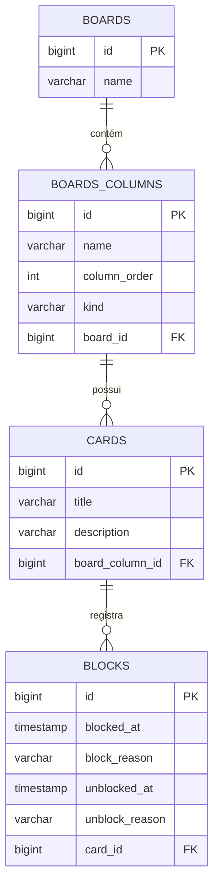

# 📌 BoardTarefas
[](https://github.com/AndreOliveiraALO/board-gerenciamento-tarefas/blob/main/LICENSE)

Projeto desenvolvido no Bootcamp **DIO + Santander**, com o objetivo de reproduzir um **quadro de gerenciamento de tarefas** (estilo Kanban).

## 🚀 Tecnologias utilizadas
- Java 17
- Maven
- PostgreSQL
- Liquibase (changelogs em YAML)

> 🔄 Diferencial: A proposta original era utilizar **Gradle + MySQL + Liquibase SQL**, porém este projeto foi desenvolvido com **Maven + PostgreSQL + Liquibase YAML**.

---

## 🗄 Estrutura do banco de dados

O versionamento do banco é gerenciado pelo arquivo **`db.changelog-master.yml`**, que centraliza os changelogs em XML.  
O Liquibase também gera o arquivo de log **`liquibase.log`**, para registrar todas as execuções.

### Modelo relacional (simplificado)


---

## ▶️ Como executar

1. Clone o repositório:
   ```bash
   git clone https://github.com/seu-usuario/boardtarefas.git
   cd boardtarefas
   ```

2. Configure o **PostgreSQL** e ajuste o arquivo `liquibase.properties` com suas credenciais.

3. Execute o Liquibase para criar as tabelas:
   ```bash
   mvn liquibase:update
   ```

4. Compile e rode a aplicação:
   ```bash
   mvn clean install
   mvn exec:java
   ```
---

## 🧑‍💻 Autor

**André Luiz de Oliveira**  
💼 Desenvolvedor Back-end Java | Spring Boot | APIs REST  
📍 Brasil  
🔗 [LinkedIn](https://www.linkedin.com/in/andre-oliveira-a9a4281b0/) | [GitHub](https://github.com/AndreOliveiraALO)

---

MIT License © 2025
